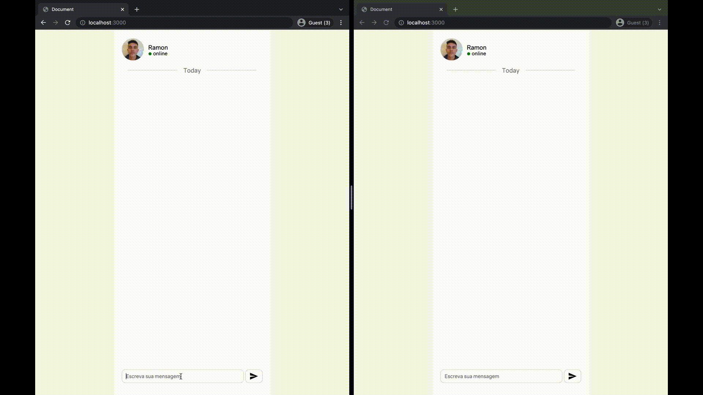

# WebChat

Um app de chat com comuicação em tempo real usando [Socket.io](https://socket.io/) com disponibilidade para conversar com outros usuários.

<p>&nbsp;</p>

As tecnologias usadas foram:

<p align="center" justify-content="center">


</p>


<p>&nbsp;</p>

O chat é construído usando HTML, CSS e Vanilla Javascript para gerar as mensagens de maneira dinâmica dentro do container de mensagens. Existe ainda a possibilidade de enviar mensagem para outra aba, janela, navegador que estejam abertos rodando o mesmo endereço e o mesmo colocará as mensagens em lados opostos para identificar o usuário que envia e o que recebe.

<p>&nbsp;</p>

O Chat fica assim: 😉 

<br/>



<br/>

# Instalação

Depois de fazer o download você deverá instalar as dependências utilizando gerenciadores de pacotes. 

usando NPM: 

```sh
npm install
```
usando Yarn
```sh
yarn add
```

Em seguida precisamos fazer a integração com o backend onde o Socket.io está configurado para que a comunicacão em tempo real seja inicializada.

<br/>

No seu terminal utilize o comando:

```sh
node index.js
```

Ou utilize o nodemon no terminal através do comando:

```sh
nodemon
```

# License
© Feito com muito &#10084; por [Ramon Pereira](https://www.linkedin.com/in/ramon-pereira88/) 🤝


